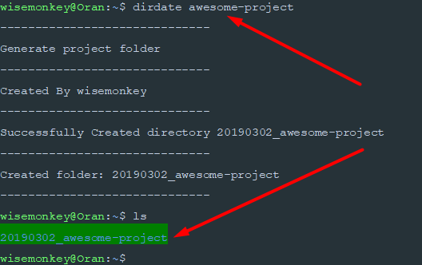

# Dirdate

Dirdate is a simiple commandline tool for creating folders with the format YYYYMMDD_XXXXXX
where 
- Y = year
- M = month
- D = day
- X = project name

## Installation

install dirdate by:

    > gem install dirdate

And then execute:

    > dirdate PROJECT_NAME
    OR
    > dirdate


## Usage

There are two modes to this simple commandline tool.
1) with arguments 
```
dirdate <name of folder>
 ```
 
 [](https://asciinema.org/a/P0zv17KwTTv8Ur9PgMZqZUnB2)
2) without arguments
[](https://asciinema.org/a/XQvobG48vPNZgqN04nzoVGceK)


## Contributing
#### This project will most likely be not maintained.
Bug reports and pull requests are welcome on GitHub at https://github.com/wisehackermonkey/dirdate.

## License

The gem is available as open source under the terms of the [MIT License](https://opensource.org/licenses/MIT).
## Development
TODO Remove detalut text

After checking out the repo, run `bin/setup` to install dependencies. You can also run `bin/console` for an interactive prompt that will allow you to experiment.

To install this gem onto your local machine, run `bundle exec rake install`. To release a new version, update the version number in `version.rb`, and then run `bundle exec rake release`, which will create a git tag for the version, push git commits and tags, and push the `.gem` file to [rubygems.org](https://rubygems.org).
